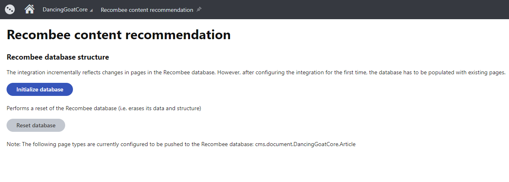

# Kentico Xperience Recombee modules
[](https://stackoverflow.com/tags/kentico)

|  | Package |
| ------------- |:-------------:|
| Administration | [](https://www.nuget.org/packages/Kentico.Xperience.Recombee.Admin.KX13/0.0.1-preview) |
| Live site | [](https://www.nuget.org/packages/Kentico.Xperience.Recombee.KX13/0.0.1-preview) |

[Recombee Recommender](https://www.recombee.com/) for [Kentico Xperience](https://xperience.io/)

This repository contains the source code for modules that integrate Kentico Xperience with Recombee Artificial Intelligence Powered Recommender as a Service.

## Description

This project consists of two modules:
* Administration module - adds the *Recombee content recommendation* application to the application menu in the Xperience administration interface, where you can initialize the Recombee database. A properly initialized database is necessary for the Recombee integration to work correctly.
* Live site module - contains API that allows you to track contact activities and load recommended pages, based on the current contact or the content of the current page.

## Requirements and prerequisites

* *Kentico Xperience 13* installed. Both ASP.NET Core and ASP.NET MVC 5 development models are supported. However, the demo site in this repository is an ASP.NET Core project.
* *Xperience Enterprise* license edition for your site, as the integration uses on-line marketing features (e.g. Contacts).
* The *Enable on-line marketing* setting needs to be selected in the *Settings* application.
* You need to have a Recombee.com account.
   - You can create your own free account at Recombee.com, or have your project registered under the Kentico organization.

> This module serves primarily as a demonstration of [AI recommendation possibilities](https://xperience.io/discover/blog/2019-10/artificial-intelligence-ai-is-here-to-help-you-w). The current implementation may not fully reflect all possible scenarios (e.g. page workflow or processing of page builder content), and further development is needed for production usage that covers all use cases.

## Setting up the environment
### Administration package installation
1. Open the solution with your administration project (*~/WebApp.sln*).
1. Navigate to the *NuGet Package Manager Console*.
1. Run *Install-Package Kentico.Xperience.Recombee.Admin.KX13 -Version 0.0.1-preview*
1. Edit the administration project's *web.config* file and add the following keys into the *appSettings* section:
    ```XML
    <add key="DancingGoatCore.Recombee.ContentRecommendation.DatabaseId" value="##YourAPIIdentifier##" />
    <add key="DancingGoatCore.Recombee.ContentRecommendation.PrivateToken" value="##YourPrivateToken##" />
    ```
    > Replace *DancingGoatCore* with the code name of your Xperience site, and the values with your Recombee API Tokens.

1. Rebuild the CMSApp project.

### Live site package installation
1. Open the solution with your live site project (e.g., *~/DancingGoatCore.sln*).
1. Navigate to the *NuGet Package Manager Console*.
1. Run *Install-Package Kentico.Xperience.Recombee.KX13 -Version 0.0.1-preview*.
1. Add the following keys into the configuration file of the live site project (e.g., *appsettings.json* for ASP.NET Core projects):
   ```JSON
   "DancingGoatCore.Recombee.ContentRecommendation.DatabaseId" : "##YourAPIIdentifier##"
   "DancingGoatCore.Recombee.ContentRecommendation.PrivateToken" : "##YourPrivateToken##"
   ```
   > Replace *DancingGoatCore* with the code name of your Xperience site, and the values with your Recombee API Tokens.

1. Rebuild your live site project.

### Recombee database structure setup
To give relevant recommendations, the Recombee service requires the data of your Xperience pages. 

By default, the integration module automatically maps the page type name and culture for pages into the Recombee database. For the fields of your page types, you need to manually ensure mapping to fields within the Recombee database.

Use the API provided by the integration package, as demonstrated by the example below. Run the code *on application start* of your Xperience administration application.
```c#
const string SITE_NAME = "DancingGoatCore";

// Gets a List of DatabaseProperty objects representing fields in the Recombee database
var itemProperties = Service.Resolve<IDatabaseConfiguration>().Get(SITE_NAME);

// Adds new fields to the Recombee database for the page content that you want to use for recommendations
itemProperties.Add(new DatabaseProperty("Title", "string"));
itemProperties.Add(new DatabaseProperty("Summary", "string"));
itemProperties.Add(new DatabaseProperty("Text", "string"));


var fieldMapper = Service.Resolve<IFieldMapper>();
var configurations = fieldMapper.GetConfigurations(SITE_NAME);
configurations.IncludedCultures.Add("en-us");

// Adds mappings for the 'DancingGoatCore.Article' page type
configurations.Mappings.Add("DancingGoatCore.Article", new List<FieldMapping>
{
    // Maps the article page type fields to the corresponding fields in the Recombee database
    new FieldMapping("ArticleTitle", "Title"),
    new FieldMapping("ArticleSummary", "Summary"),

    // Example demonstrating advanced field mapping
    // This approach allows mapping of data outside standard page type fields, such as page tags, categories or images (URLs)
    new FieldMapping(article => article.GetValue("ArticleText"), "Text")
});
```
> We recommend using a custom Xperience module to run this initialization code on application start. See the example in the [Kentico.Xperience.Recombee.Admin.SampleConfiguration](src/Kentico.Xperience.Recombee.Admin.SampleConfiguration) folder.

### Recombee database initialization

1. Once the previous steps are done, open the Xperience administration interface and navigate to the *Recombee content recommendation* application.

1. Click the *Initialize database* button to set up the Recombee database.
> The *Reset database* button completely removes existing data and the database structure from the Recombee database. Use it only when you want to completely remove or reset the Recombee integration.

## Getting recommendation data

To work with the data from Recombee on the live site, you need to use the API of the live site integration module. Two types of recommendation scenarios are currently supports:
* Log page visits by contacts and then recommend pages to contacts according to their previous activity.
* Recommend related pages to visitors based on the content of the page they are currently viewing.

### Recommending pages based on contact page views
First, you need to ensure logging of page views: 
```c#
private readonly IContentService contentService;

public ExampleController(IContentService contentService)
{
  this.contentService = contentService;
}

public void ExampleMethod()
{
  ...

  contentService.LogPageView(TreeNode page, Guid contactGuid);
}
```
Perform the logging for all page types where you have set up field mapping to the Recombee database.

Afterwards, you can get a list of recommended pages based on the contact's previous page views:
```c#
// Gets a collection of 'PageIdentifier' objects, 
// containing the identifiers of Xperience pages recommended for the specified contact
contentService.GetPagesRecommendationForContact(string siteName, Guid contactGuid, int count, string culture, IEnumerable<string> pageTypes = null);
```
Use the data to display a list of recommendation on your website.

### Recommending related pages based on the current page
You can retrieve a list of pages that are chosen by the Recombee service based on the content of the current page:
```c#
private readonly IContentService contentService;

public ExampleController(IContentService contentService)
{
    this.contentService = contentService;
}

public void ExampleMethod()
{
    ...

    // Gets a collection of 'PageIdentifier' objects, 
    // containing the identifiers of Xperience pages recommended for the specified page and contact
    contentService.GetPagesRecommendationForPage(TreeNode page, Guid contactGuid, int count, string culture, IEnumerable<string> pageTypes = null);
}
```

## Get involved

Check out the [contributing](CONTRIBUTING.md) page to see how to file issues, start discussions, and begin contributing.

## Questions & Support

See the [Kentico home repository](https://github.com/Kentico/Home/blob/master/README.md) for more information about the product(s) and general advice on submitting questions.


